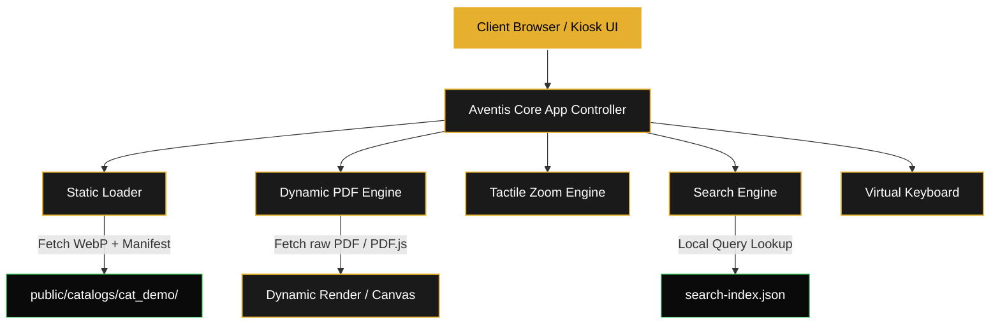

# ⚜️ Aventis - Premium Digital Catalog Flipbook

[](https://vite.dev/)
[](https://expressjs.com/)
[](https://developer.mozilla.org/)
[](https://opensource.org/licenses/MIT)

Aventis is a high-performance, client-first digital brochure and interactive catalog viewer designed for premium showrooms, tablet-based kiosks, and modern web environments. Built on top of a highly optimized skeletal structure, it blends state-of-the-art canvas rendering, realistic 3D-like page-flipping physics, and instant localized search query indexing.

---

## 🌟 Key Features

*   **Realistic Page-Turn Physics**: Smooth, tactile, and highly realistic page flipping driven by an optimized Turn.js layout engine.
*   **Dual Loading Pipelines**:
    *   *Static Pre-Baked WebP*: Instantly loads compressed, high-definition static WebP sheets to guarantee zero startup lag on mobile or kiosk devices.
    *   *On-the-Fly PDF Rendering*: Dynamically streams and parses raw PDF files inside the browser canvas using PDF.js.
*   **Zero-Latency Search Indexing**: Incorporates pre-baked client-side search registries (`search-index.json`) for instant full-text lookups and validation with absolutely zero server-side database bottlenecks.
*   **Tactile Zoom Engine**: Supports seamless pinch-to-zoom gestures for mobile touchscreens alongside visual controls for fluid detailed examinations.
*   **Modern Virtual Keyboard**: A highly polished, responsive custom touch keyboard optimized for physical kiosk stands and tablets.
*   **Dual Server Architectures**: Engineered to run seamlessly in hot-reloading development servers (Vite middleware) and containerized production environments (Express container).

---

## 🏗️ Architecture & Data Flow

Below is the conceptual architecture showcasing the client-first data flow, rendering engines, and hybrid file loading model:



---

## 🛠️ Technology Stack

*   **Frontend UI Layer**: Pure Semantic HTML5, Vanilla Modern CSS3, jQuery (DOM manipulation), and Montserrat/Inter Typography.
*   **Physics Engine**: Custom-integrated Turn.js engine for tactile page-flipping physics.
*   **PDF Parsing**: PDF.js for parsing and rendering PDF canvases client-side.
*   **Build Pipeline**: Vite for asset bundling, hot-reloading development middleware, and asset minification.
*   **Production Host**: Express.js production server with robust static serving and SPA client fallback routing.

---

## 🚀 Quick Start Guide

### Prerequisites
*   [Node.js](https://nodejs.org/) (v16.0.0 or higher recommended)
*   npm (installed automatically with Node.js)

### 1. Installation
Clone the repository and install the workspace dependencies:
```bash
npm install
```

### 2. Run in Development Mode
Launch the high-speed Vite development server with hot module reloading:
```bash
npm run dev
```
Open your browser and navigate to `http://localhost:5173`.

### 3. Build Production Bundle
Compile and minify the frontend assets into a production-ready `dist/` directory:
```bash
npm run build
```

### 4. Start Production Server
Launch the lightweight Express container to serve the static application:
```bash
npm start
```
Open your browser and navigate to `http://localhost:3000`.

---

## 📂 Project Structure

```text
├── public/                 # Static Assets Folder
│   ├── catalogs/           # Catalog Directories (WebP pages, manifests)
│   │   └── cat_demo/       # Aventis Premium Demo Catalog
│   ├── lib/                # Static External Libraries
│   ├── emblem.svg          # Luxury Minimalist Emblem SVG
│   ├── logo.svg            # Horizontal Luxury Wordmark SVG
│   └── catalogs.json       # Public Catalog Registry
├── src/                    # Source Code
│   ├── lib/                # Local JS libraries
│   ├── main.js             # Core Application & Search Logic
│   └── style.css           # Premium Layout Styling & Responsive Rules
├── server.js               # Production Express Server Setup
├── vite.config.js          # Vite Middleware & Development Bundler
├── package.json            # Scripts & Workspace Dependencies
└── README.md               # Stunning Showcase Documentation
```

---

## 📄 License

This project is licensed under the MIT License - see the [LICENSE](LICENSE) file for details.
